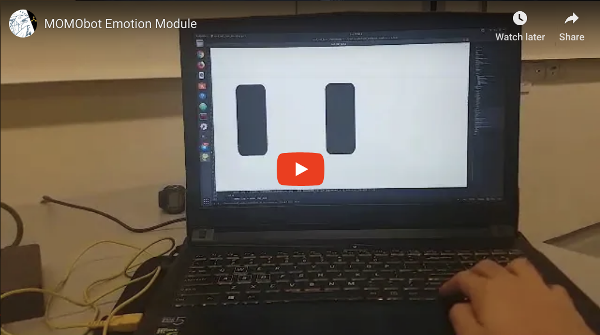

# momo-emotions
Emotion expression ROS module for the MOMObot.

[](https://youtu.be/tPQx6j_7Lnk)

**Dependencies**

- rospy
- pygame

Subscribes to /cmd_vel and /scan. Eyes blink automatically, and will move when /cmd_vel is set to let the robot pivot or steer left and right.

If laser obstacles are close-by, the eyes will also look down!

**To test:**

```bash
# Terminal 1
$ roscore

# Terminal 2
$ rosrun momo_emotions cmd_vel_face_tracking.py

# Terminal 3
$ rosrun teleop_twist_keyboard teleop_twist_keyboard.py # Then steer left and right
```

You may also test the package using the arrow keys instead of a teleoperation node.

Pressing *k* also makes the face change!